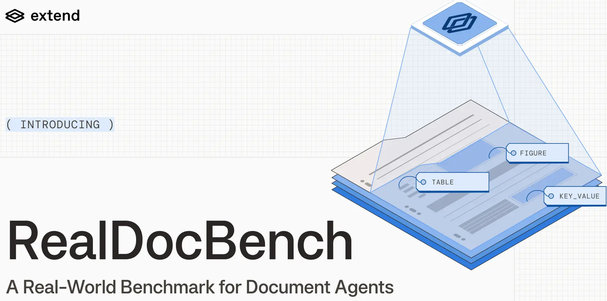

<p align="center">
  
</p>

# RealDocBench

[](https://huggingface.co/datasets/Extend-AI/RealDoc-Bench)
[](https://huggingface.co/datasets/Extend-AI/RealDoc-Bench-Layout)

A document parsing benchmark that measures two things on real documents:

1. **Layout quality** — bounding-box and block-type predictions versus human annotation, with F1, adjusted F1, mAP, and per-block-type breakdowns.
2. **QA extraction quality** — for each (question, parser) pair, an LLM extractor (**Gemini 3 Flash**) is asked to answer the question from the parser's markdown alone. Per-field scoring with `deep_equal` against a typed-JSON gold (with a conservative fuzzy fall-back for plain-string fields).

Each mode reports cost and latency alongside quality.

## Document QA Leaderboard (1,359 questions)

| Parser | Per-field Accuracy | Per-question Accuracy |
| --- | ---: | ---: |
| **Extend Parse 2.0** | **95.7%** | **90.3%** |
| LlamaParse (Agentic) | 92.1% | 84.3% |
| Reducto (Agentic) | 91.1% | 83.1% |
| Extend v1 | 90.4% | 81.8% |
| Gemini 3.5 Flash | 89.0% | 81.6% |
| LlamaParse | 89.0% | 80.4% |
| Azure DI | 88.8% | 78.9% |
| Reducto | 88.5% | 80.2% |
| AWS Textract | 70.5% | 53.6% |

## Layout Leaderboard
| **Model** | **N** | **Strict F1** | **Adjusted F1** | **Macro F1** | **Precision** | **Recall** |
| --- | --- | --- | --- | --- | --- | --- |
| **Extend Parse 2.0** | 1500 | **0.781** | **0.847** | 0.702 | 0.818 | 0.748 |
| **AWS Textract** | 1500 | **0.626** | **0.709** | 0.526 | 0.598 | 0.656 |
| **Paddle OCR VL 1.5** | 1500 | **0.584** | **0.684** | 0.450 | 0.661 | 0.524 |
| **Azure DI** | 1500 | **0.558** | **0.687** | 0.521 | 0.492 | 0.644 |
| **dots.mocr** | 1500 | **0.238** | **0.320** | 0.188 | 0.225 | 0.253 |

## Installation
```bash
uv sync
```

## API Keys

All secrets load from `.env` (or `.env.local` for machine-specific overrides; gitignored, wins on conflict) at the repo root — auto-loaded by the CLI. See [`.env.example`](.env.example) for the full list of supported variables. Keys needed per command:

- `score` — `GEMINI_API_KEY` (or `GOOGLE_API_KEY`)
- `parse` — whatever the parsers require: `EXTEND_API_KEY`, `LLAMA_CLOUD_API_KEY`, AWS / Azure creds, …
- `download` and the layout dataset fetch — no key needed (the datasets are public)

**Dataset overrides** — point `REALDOC_BENCH_DATASET_EXTEND_AI_REALDOCBENCH_LAYOUT` at a local snapshot to skip the HF download.

## QA-extraction benchmark

The full pipeline is download → parse → score → report. Every stage is per-parser scoped, cached, and reusable.

**QA Evaluator** — the extraction step uses **Gemini 3 Flash** (`gemini-3-flash-preview`) for every parser. It reads only the parser's markdown, emits typed JSON, and that JSON is scored deterministically with `deep_equal` against the gold — the model never sees the gold and never assigns a score itself. The same model and prompt are applied to every parser, so no parser is judged differently (including the `gemini_3_5_flash` parser, which is scored by the same judge as everyone else).

```bash
# 1. Pull the bench dataset (qa_bank.json + docs/) from the HF Hub
realdoc-bench evaluate download --run-dir runs/qa --dataset Extend-AI/Realdoc-Bench

# 2. Parse every PDF with one or more parsers (idempotent; --force to re-parse)
realdoc-bench evaluate parse --run-dir runs/qa -p reducto -p aws_textract -p azure_di

# 3. Score every (question × parser) pair with Gemini 3 Flash + deep_equal
#    No -p means: score every parser found under <run-dir>/parses/
realdoc-bench evaluate score --run-dir runs/qa

# 4. Build the dashboard
realdoc-bench evaluate report --run-dir runs/qa
```

Or all at once for a known parser set:

```bash
realdoc-bench evaluate run --run-dir runs/qa -p reducto -p aws_textract
```

**Run-dir layout**:

```
runs/qa/
  docs/                          # input — documents (PDFs)
  qa_bank.json                   # input — typed-template QA bank
  parses/<parser>/<stem>.md      # parser output (+ <stem>.json meta)
  eval/cache/<qid>__<parser>.json   # per-(question, parser) scoring cache
  eval/results.json              # flat snapshot rebuilt by `report`
  dashboard.html                 # the dashboard
```

**Cache semantics**:

- `parse` skips `(parser, doc)` when `.md` + `.json` exist and the json's `ok=true`. `--force` busts the cache for the listed parsers only.
- `score` skips `(qid, parser)` when the cache file exists. **On hit, the cached answer is re-scored with the current scoring code**, so editing scoring thresholds + re-running `score` updates verdicts without spending a single API call. `--force` re-calls the model.
- Per-parser scope is strict: scoring `-p X` never touches any other parser's cache files.

**API keys** — see [API Keys](#api-keys). `score` needs `GEMINI_API_KEY`, `parse` needs whatever the parsers require; `download` needs no key (the dataset is public).

## Layout benchmark

```bash
# 0. (optional) Pre-download the layout dataset — prewarm the HF cache,
#    or materialize a filtered subset into --out-dir.
realdoc-bench layout download --dataset Extend-AI/RealDocBench-Layout

# 1. Run one or more processors over the layout dataset and score every page
realdoc-bench layout eval --dataset Extend-AI/RealDocBench-Layout --processor gt_self --limit 5

# 2. Build the markdown + Pareto-plot report from a previous run
realdoc-bench layout report --run-id <id>
```

`--dataset` defaults to `Extend-AI/RealDocBench-Layout` and can be omitted; pass a different HF repo id to point at another snapshot. `layout download` accepts the same `--dataset`/`--revision`, plus `--domain`/`--limit` to fetch a filtered slice and `--out-dir` to materialize the snapshot at a known path (point `REALDOC_BENCH_DATASET_EXTEND_AI_REALDOCBENCH_LAYOUT` at it to use it without re-downloading).

### Scorer

Two scorers are wired into `layout eval`; both build on a Hungarian matcher.

- **`f1`** (default) — Hungarian on `1 − IoU`, IoU ≥ 0.5, wrong-type pair → FP + FN. Backwards-compatible with the legacy leaderboard.
- **`adjacency`** — Hungarian on `1 − IoU + 0.25·type` (wrong-type pair stays TP, surfaced as `misclassifications`) with adjacency split/merge recovery; reports an additional **adjusted F1** that lets the matcher merge adjacent same-type fragments to recover from over/under-segmentation. See [`realdoc_bench/layout/metrics/adjacency/`](realdoc_bench/layout/metrics/adjacency/).

```bash
realdoc-bench layout eval -p extend_v2_0_0 --limit 50 --scorer adjacency
```

The adjacency scorer also has a Python API and a re-score command that re-scores an existing run's cached predictions (no model calls):

```python
from realdoc_bench.layout.metrics.adjacency import score_pairs
result = score_pairs(pairs, iou_threshold=0.5, gap_threshold=0.02)   # pairs := [(pred_blocks, gt_blocks, page_w, page_h), ...]
print(result.strict.micro_f1, result.adjusted.micro_f1)
```

```bash
realdoc-bench layout rescore --run-id <id>
```

### Assumptions

- **Block-type vocabulary — 9 classes:** `text`, `heading`, `section_heading`, `header`, `footer`, `page_number`, `figure`, `table`, `key_value`. The dataset's raw COCO `category_id` integers are folded into these on load by `realdoc_bench/layout/normalizers/coco.py`; processor normalizers map vendor output into the same set. Legacy cached `prediction.json` files written under the previous 18-class names load unchanged — a Pydantic `field_validator` coerces them on read.
- **Dataset:** [`Extend-AI/RealDocBench-Layout`](https://huggingface.co/datasets/Extend-AI/RealDocBench-Layout) (1,500 pages) by default; override with `--dataset <repo-id>`. Manifest + image + COCO blobs all come from HF on first use (or point `REALDOC_BENCH_DATASET_EXTEND_AI_REALDOCBENCH_LAYOUT` at a local snapshot).
- **Matching:** axis-aligned IoU, threshold 0.5 (`--iou-threshold` to change). No confidence sweep — every prediction counts positive at IoU ≥ 0.5; mAP is computed separately when `confidence_present=True`.
- **Adjusted F1 (adjacency only):** after the 1:1 match, unmatched same-type preds with gap < `0.02 × max(page_w, page_h)` are merged and re-scored; symmetric for unmatched GTs.
- **Cost & latency:** each processor reports `cost_estimate_usd` / `latency_sec` per page when available; aggregates carry `$/page` and `latency_sec/page`, and the snapshot Pareto plots use them.

## Datasets

Distributed via the [Hugging Face Hub](https://huggingface.co/Extend-AI) under the `Extend-AI` org.

- [`Extend-AI/RealDocBench-Layout`](https://huggingface.co/datasets/Extend-AI/RealDocBench-Layout) — 1,500-page layout benchmark with COCO annotations.
- [`Extend-AI/Realdoc-Bench`](https://huggingface.co/datasets/Extend-AI/RealDocBench) — QA-extraction bench (1,359 questions × 581 documents). What `evaluate download` pulls.

The layout set ships its `manifest.csv` (page list + per-page metadata) alongside `images/` and `annotations/` on HF.

## License

- Code in this repo: Apache-2.0 (see `LICENSE`).
- Benchmark datasets live on Hugging Face and carry their own licenses — see the dataset pages: [`Extend-AI/Realdoc-Bench`](https://huggingface.co/datasets/Extend-AI/RealDocBench), [`Extend-AI/RealDocBench-Layout`](https://huggingface.co/datasets/Extend-AI/RealDocBench-Layout).
