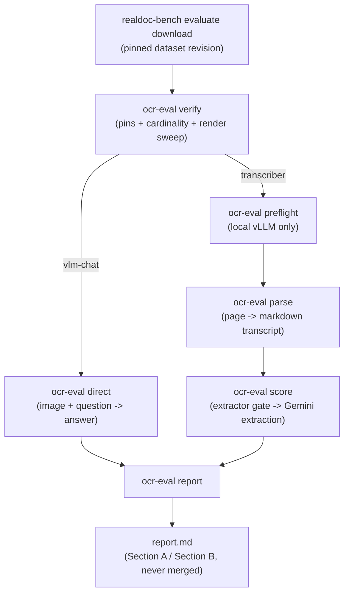

# Architecture

How `ocr_eval_ext/` extends upstream `realdoc_bench/`: the module map, what a run directory looks
like on disk, how the condition dict flows into cache keys, cache invalidation semantics, exactly
what was changed in upstream code (and why only that), and the fail-closed gates that run before
any spend. **Who should read this:** anyone modifying the harness, debugging a run's on-disk state,
or deciding whether a new Stage 2 axis needs a new cache key. For day-to-day commands see
[`cli.md`](cli.md); for the scoring rubric see [`scoring.md`](scoring.md).

## Module map (`ocr_eval_ext/`)

| Module | Responsibility | Key interfaces |
|---|---|---|
| `config.py` | Registry schema + loader. One entry per (model, serving) pair. | `RegistryEntry` (pydantic; `shape: Literal["vlm-chat","transcriber"]`, `transport: Literal["openai-compat","upstream-parser"]`, `.contaminated` property); `load_registry(path) -> list[RegistryEntry]`; `get_entry(entries, id) -> RegistryEntry`; `CONTAMINATION_CUTOFF` |
| `preconditions.py` | Fail-closed gates: bucket cardinality, single-page, non-blank render. | `check_bank(items) -> dict` (raises `PreconditionError`); `assert_single_page(pdf_path) -> int`; `ink_coverage(png_bytes) -> float`; `items_with_tags`/`boolean_fields`/`null_fields`; `CHECKBOX_TAGS`, `BLANK_TAGS`, `EXPECTED` |
| `metrics.py` | Boolean/null-restricted per-field outcomes and baselines. | `FieldOutcome` (dataclass: qid/key/doc/gold/status); `field_outcomes(records, fields) -> list[FieldOutcome]`; `checkbox_metrics(outcomes) -> dict`; `null_metrics(outcomes) -> dict`; `baseline_rows(fields) -> dict` |
| `stats.py` | Document-clustered bootstrap. | `cluster_bootstrap_ci(outcomes, iters=2000, seed=0, alpha=0.05) -> (lo, hi)`; `paired_delta_ci(a, b, ...) -> (lo, hi)`; `separable(delta_ci) -> bool` |
| `direct.py` | The `vlm-chat` runner: page image + question → typed JSON answer. | `STAGE1_CONDITION`; `condition_hash(condition) -> str`; `parser_key(entry_id, condition) -> str`; `run_direct(layout, entries, *, condition=STAGE1_CONDITION, workers=8, dry_run=False, max_spend_usd=None, ...) -> dict` (summary); retry helpers `_is_retryable`/`_retry_wait` (reused by `parsers_openai.py`) |
| `parsers_openai.py` | Bridges the registry model into upstream's `ParseProvider` machinery for OpenAI-compatible transcribers. | `TRANSCRIBER_CONDITION`; `OpenAICompatVisionParser` (subclassed per registry entry); `safe_name(entry_id) -> str`; `register_openai_parsers(registry_path) -> list[str]`; `preflight(entry) -> str` |
| `selftest.py` | Fail-closed self-tests for the scorer and the Gemini extractor. | `FIXTURES`, `EXTRACTOR_FIXTURES`; `run_offline() -> list[str]` (failures); `run_extractor() -> list[str]` |
| `cli.py` | The `ocr-eval` CLI: `verify`/`selftest`/`direct`/`rescore`/`preflight`/`parse`/`score`/`report`. | `_preflight(layout, *, allow_partial_corpus=False, skip_corpus_check=False)` — the gate every spending/reporting command calls first |
| `report_md.py` | Pure-function, shape-segregated markdown report builder. | `build_markdown_report(layout, entries, *, allow_stale_render=False, iters=2000) -> str`; `ReportError`, `StaleRenderError`, `ServingIdentityError` |

## Run-dir anatomy

```
<run-dir>/
  docs/                            input PDFs (upstream `evaluate download`)
  docs_png/                        rendered-page PNG cache, keyed {stem}@{dpi}@{preprocess}.png
                                    (ocr_eval_ext/direct.py `_render_page`, cli.py `verify`)
  qa_bank.json                     the QA bank (upstream `evaluate download`)
  parses/<parser>/<stem>.md        transcript (upstream `run_parse`; our transcriber parsers too)
  parses/<parser>/<stem>.json      per-doc parse metadata: cost_usd, latency_sec (upstream `_parse_one`)
  parses/<parser>/condition.json   TRANSCRIBER_CONDITION sidecar, written once per registered
                                    parser by `ocr_eval_ext/cli.py`'s `parse` command
  eval/cache/<qid>__<parser>.json  per-(question, parser) scoring cache — upstream `_worker`/
                                    `score.py` for transcriber rows; `direct.py`'s `do()` for
                                    vlm__ rows (same on-disk shape, so upstream rescoring/
                                    aggregation work unchanged on either)
  eval/results.json                flat snapshot of eval/cache/, rebuilt by upstream `aggregate_results`
  run_meta.json                    pins + stamps: dataset_revision, harness_commit, renders_verified,
                                    partial_corpus, pymupdf_version, extractor_id (written by
                                    cli.py's `_stamp_base_meta`/`verify`/`_enforce_extractor_generation`)
  report.md                        this fork's authoritative output (`ocr-eval report`)
  dashboard.html / dashboard-upstream-UNSEGREGATED.html
                                    upstream's shape-mixed HTML report — renamed on sight by
                                    `ocr-eval report` so it can never be mistaken for authoritative
```

`RunLayout` (`realdoc_bench/evaluate/runs.py`) centralizes every path above except `docs_png/`,
`run_meta.json`, and the `dashboard-upstream-UNSEGREGATED.html` rename, which are this fork's own
additions layered on top (`docs_png` and `run_meta.json` paths are recomputed inline in `cli.py`
and `direct.py` rather than added to `RunLayout`, to avoid touching upstream's dataclass).

## The condition dict

A condition is a plain dict — `STAGE1_CONDITION` (`direct.py`) for vlm-chat cells, and the module
constant `TRANSCRIBER_CONDITION` (`parsers_openai.py`) for transcriber cells — covering
`preprocess`, `render` (engine/dpi), `sampling` (temperature/top_p/max_tokens/seed for vlm-chat;
temperature/max_tokens only for transcribers), `output_contract`, and `sample_index`. It is hashed
with `condition_hash()` (`sha256(json.dumps(condition, sort_keys=True))`, truncated to 12 hex
chars) and that hash is folded directly into the parser key:

- vlm-chat: `vlm__<entry.id>__<condition_hash>` (`direct.py`'s `parser_key`)
- transcriber: `<safe_name(entry.id)>__<condition_hash>` (`parsers_openai.py`'s
  `register_openai_parsers`)

This means a Stage 2 axis change (e.g. `preprocess: deskew`) produces a **new** parser key rather
than overwriting the existing one — the cache never silently conflates two conditions under one
label. This has been live-validated: the local-validation Ollama run generated two distinct
condition hashes for the *same* registry entry (`qwen3-vl-8b@ollama-validation`) — the default
`max_tokens: 1024` condition and a hand-amended `max_tokens: 8192` condition used to work around
the thinking-model empty-response caveat (see [`cli.md`](cli.md)'s worked example). Both landed as
separate rows with distinct 12-hex-char suffixes, and `report_md.py`'s `_disambiguated_labels`
detected the collision on the shared registry id and rendered both with a `[cond <hash>]` suffix
rather than merging them.

## Cache semantics

Two-level cache, both keyed off the on-disk shape upstream already uses:

1. **Transcripts** are files: `parses/<parser>/<stem>.md` + a `.json` metadata sidecar
   (cost/latency/ok). One transcript per (document, parser, condition) — never re-transcribed per
   question.
2. **Extraction/answer rows** are one JSON file per (question, parser):
   `eval/cache/<qid>__<parser>.json`.

**Cache-hit contract:** upstream's `_worker` (`realdoc_bench/evaluate/score.py`) treats a row as
cached whenever the JSON file has an `"answer"` key at all (including an explicit `"answer": null`)
— on a hit it **re-scores** the stored answer against the *current* `score_typed`/`build_template`
code and rewrites the file if the verdict changed. This is why a scoring-code fix (e.g. adjusting
`FUZZ_THRESHOLD`) updates every cached verdict for free on the next `score`/`rescore` call, with
zero API calls. `ocr-eval rescore` (`cli.py`) exposes this same recompute-from-cache path
explicitly for both shapes at once.

**What invalidates what:**
- A *condition* change (temperature, dpi, max_tokens, preprocess, ...) changes the parser key
  itself — no explicit invalidation needed, it's simply a different row.
- A rendered-image change (swapped/edited PDF) is **not** in the cache key at all — `image_sha` is
  a row-level field, checked by `report_md.py`'s D3 STALE-RENDER gate at report time, not by the
  cache layer.
- A scoring-code or template change is picked up automatically on the next cache hit (see above) —
  never requires deleting cache files.
- **Extractor-generation archival:** `ocr-eval score --new-extractor-generation` is required before
  scoring with a different Gemini extractor id than the one already stamped in
  `run_meta.json["extractor_id"]`. It archives only extractor-*dependent* rows (parser key does
  **not** start with `vlm__`) to `eval/cache@<old-id>/`; `vlm__*` direct-QA rows stay live in
  `eval/cache/` since they carry no Gemini-extractor dependency and re-archiving them would force
  needless re-spend on the next `direct` run (`cli.py`'s `_enforce_extractor_generation`).

## Fork boundaries

**The only upstream file modified is `realdoc_bench/cli.py`**, and the only change is to its
`_env()` helper: upstream unconditionally loads `.env.local`/`.env`; this fork gates that behind
`RDB_ALLOW_DOTENV=1` (unset by default), matching the project's environment-only keys policy.
Verified against `git diff upstream/main -- realdoc_bench/cli.py` — a four-line diff, nothing else
in `realdoc_bench/` touched.

Everything else new lives additively in `ocr_eval_ext/`. Two pins gate every run:
`harness_commit` and `dataset_revision` in `configs/pins.yaml`. `cli.py`'s `_preflight()` asserts
both before any command that touches a run dir: `harness_commit` via `git merge-base HEAD
<pin>` (proves ancestry, not working-tree purity — a separate warning fires on uncommitted changes
to `realdoc_bench`/`ocr_eval_ext`), and `dataset_revision` via a stamped `run_meta.json` check plus
an independent cross-check against the on-disk HuggingFace snapshot metadata (`_observed_dataset_revision`)
— the latter is ground truth and cannot be fooled by a hand-edited `run_meta.json`.

## Fail-closed inventory

Every gate that can stop a run before or during spend, and its escape hatch (if any):

| Gate | Protects against | Lives in | Escape hatch |
|---|---|---|---|
| Scorer self-test | A scorer that can't catch a known-wrong answer (incl. polarity inversion) grading real spend | `selftest.py` `run_offline`; run at the top of every `_preflight` | none |
| Extractor validation gate | A broken/drifted Gemini extractor scoring real transcripts | `cli.py` `require_extractor_gate`; blocking before `score`'s Gemini spend | none — cached pass per (run dir, model, fixture-hash) once green |
| Cardinality preconditions | Silent tag-rename or bucket drift changing what counts as "checkbox" | `preconditions.py` `check_bank` | none — stop-and-investigate by design |
| Corpus completeness | `docs/` narrower than the bank, scored as if it were the full corpus | `cli.py` `_check_corpus_completeness`, inside `_preflight` | `--allow-partial-corpus` (stamps `partial_corpus: true`, sticky) |
| Pin checks | Running against an unpinned/drifted harness commit or dataset revision | `cli.py` `_preflight` | none |
| Single-page + non-blank render sweep | A multi-page swap or a blank scan scored as real content | `preconditions.py` `assert_single_page`/`ink_coverage`; `verify`'s full sweep | `--skip-renders` skips the sweep itself (not the underlying check — see [`cli.md`](cli.md)) |
| Parse content floor | A near-empty transcript (thinking model exhausted its budget) entering scoring | `cli.py` `parse()` — `md_length <= 16 * page_count` | none |
| `--max-spend` fail-closed rule | An unpriced/unknown-cost cell being silently treated as free | `direct.py` `run_direct`'s `track()` | none — raises rather than assuming $0 |
| D3 STALE-RENDER | A `vlm__` row's `image_sha` no longer matching the doc's current render | `report_md.py` `_check_stale_renders` | `--allow-stale-render` |
| D4 serving identity | One parser key's rows resolving to more than one OpenRouter provider | `report_md.py` `_check_serving_identity` | none |
| Cached-error visibility | A rerun silently absorbing a prior run's error cells into "cached" | `direct.py` (`cached_error` tally); `cli.py` `direct()` exits 2 | delete the affected `eval/cache/` rows, or `--force` (re-bills the whole matrix) |
| Extractor-generation gate | Mixing verdicts from two different Gemini extractor generations under one cache | `cli.py` `_enforce_extractor_generation` | `--new-extractor-generation` (archives extractor-dependent rows first) |

## Data flow


